# ERD – Asset Management (Mermaid)

This ERD is derived from the repository SQL schema (db/dbv20.sql, db/all_migrations_combined.sql) and canonical backups (db/backups/dbv100, db/dblive3v2.11-5-14-26). It focuses on primary keys, foreign keys, and core business fields.

## Full System ERD (Paginated for PDF)

  

  

  

  

  

  

  

  

---

## 0) Master Relationship Map

Notes:
- Some columns such as `users.role_id` are present but not always declared with an explicit FK in the dumps; they are treated as logical associations where applicable.

---

## 1) Catalog and Asset Core

---

## 2) Assignments and Lifecycle Forms

---

## 3) Requests and Gate Passes

---

## 4) Roles and Permissions

---

## 5) Audit and Compliance

---

## 6) Asset Builder and Documents

Notes:
- `asset_counters` appears with company-only PK in some dumps and company+department in others; included here with both fields to reflect repository variability.

---

### Rendering
- These diagrams are Mermaid `erDiagram` blocks and should render in supported Markdown viewers (e.g., GitHub, VS Code with Mermaid extensions).
- For very large diagrams, prefer viewing the module-focused sections instead of the master map.
